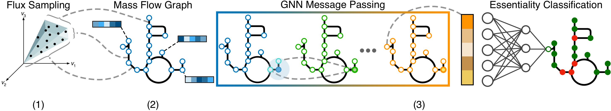

# FluxGAT: Integrating Flux Sampling with Graph Neural Networks for Unbiased Gene Essentiality Classification

## Description
FluxGAT introduces a graph neural network (GNN) model designed to predict gene essentiality by utilising graphical representations derived from flux sampling data. This approach effectively bypasses the traditional reliance on objective functions in flux balance analysis (FBA), thereby reducing observer bias. By harnessing the capabilities of GNNs, FluxGAT adeptly captures the intricate interplay within metabolic reaction networks, facilitating more accurate and unbiased predictions of gene essentiality.

## Installation
To set up your environment for running FluxGAT, please follow these instructions. It is recommended to use a virtual environment to avoid conflicts with existing installations.

First, clone or download this repository to your local machine. Then, navigate to the repository's root directory and run the following command to install the required dependencies:

```bash
pip install -r requirements.txt
```

## Usage
Below is the workflow diagram to help understand the different steps involved in the process:



Follow the steps below in order. Ensure each script completes successfully before proceeding to the next.

### Step 1: Flux Sampling
This step involves running the 'flux_sampling.py' script to perform flux sampling on the genome-scale metabolic model (GSMM). The script will generate flux sampling data, which is essential for subsequent steps in the analysis.

**Location:** Begin by navigating to the 'sampling' directory within your project's root folder.

**Command:**
```bash
cd sampling
python flux_sampling.py
```
**Expected Output:** The script saves the flux sampling data to the data directory. Please verify that the output file(s) are correctly generated in the specified location before proceeding.

### Step 2: Graph Creation
After completing flux sampling, the next step is to create the graph data structure required for training the FluxGAT model. This involves processing the flux sampling data to calculate a mass flow graph (MFG), node features, and node labels. Three scripts located in a 'graph_creation' directory from the project root are responsible for these tasks:

- MFG_calc.py: Creates a Mass Flow Graph (MFG) based on the flux sampling data.
- node_features.py: Generates node features from reactant and product information contained within the GSMM.
- node_labels.py: Uses the gene protein reaction (GRP) rules within the GSMM to map gene essentiality to reaction (node) essentiality. 

**Running the Scripts:**
These scripts can be run in any order and are located in a directory named graph_creation. Navigate to this directory and execute each script as follows:
```bash
cd graph_creation
python MFG_calc.py
python node_features.py
python node_labels.py
```
**Expected Output:** Each script will produce data files necessary for constructing the graph. These files are typically saved in the 'data' directory. Ensure that all the output files are generated before moving to the next step.

### Step 3: FluxGAT Training and Testing
This step involves training and testing the FluxGAT model with k-fold cross-validation to ensure its accuracy and robustness. This process is divided into two main tasks: generating k-fold masks and running the training/testing cycle.

**Generating K-Fold Masks:**
First, navigate to the data directory from the project root. Here, you'll run the 'k_fold_node_masking.py' script, which prepares the dataset for k-fold cross-validation by creating masks for training and testing phases.
```bash
cd data
python k_fold_node_masking.py
```
**Expected Output:** This script produces a DataFrame containing the k-fold masks for the graph data, which are used to segment the data into training and testing sets for each fold of the validation process. The output is typically saved in a file (e.g., k_fold_masks.pkl) within the same data directory. Verify that this file is created before proceeding.

**Running FluxGAT Training and Testing:**
Next, navigate to the 'model' directory from the project root, where the 'FluxGAT.py' script resides. This script utilises the k-fold masks generated in the previous step to perform k-fold cross-validation on the FluxGAT model.
```bash
cd model
python FluxGAT.py
```
**Expected Output:** The FluxGAT.py script trains the model on each fold's training data and evaluates its performance on the testing data. The results, including accuracy and loss metrics for each fold, are printed to the console or saved to an output file (e.g., FluxGAT_predictions.pkl). Ensure that the training process completes successfully and review the output metrics to assess the model's performance.

## Contributing
Contributions to improve FluxGAT are welcome. If you have suggestions or enhancements, please open an issue first to discuss what you would like to change. For substantial changes, please open a pull request for review.

Ensure to update tests as appropriate and maintain the anonymity of the repository.

## Acknowledgments

This project builds upon the foundational work in flux sampling methodologies and graph neural network architectures. We extend our gratitude to the researchers and developers whose contributions have made this project possible.

## Contact Information
For any inquiries, suggestions, or contributions, please open an issue in this repository, and we will get back to you as soon as possible.

## Citation
Please cite the following paper if you use FluxGAT in your research:
```bibtex
@article{sharma2024fluxgat,
  title={FluxGAT: Integrating Flux Sampling with Graph Neural Networks for Unbiased Gene Essentiality Classification},
  author={Sharma, Kieren and Marucci, Lucia and Abdallah, Zahraa S},
  journal={arXiv preprint arXiv:2403.18666},
  year={2024}
}
```

You can access the paper directly [here](https://doi.org/10.48550/arXiv.2403.18666).

Thank you for supporting our research!
